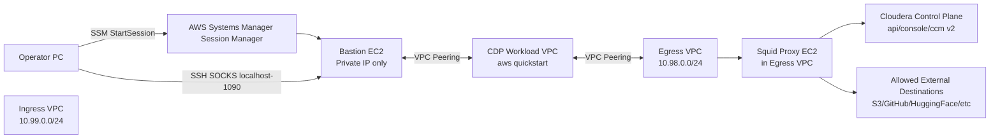
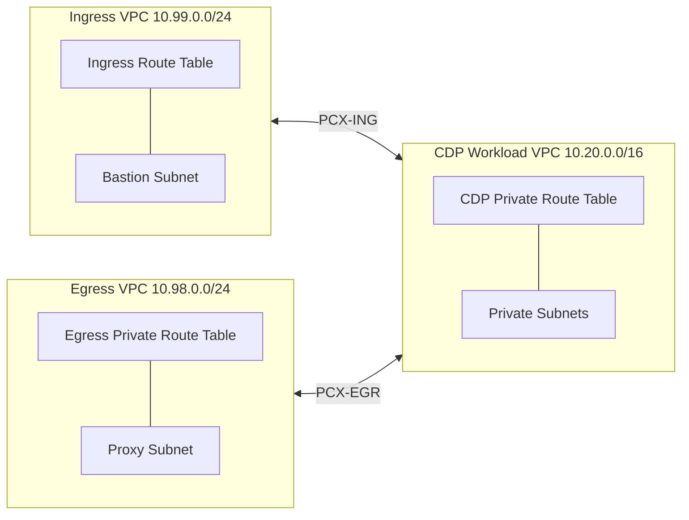

# Cloudera on Cloud フルプライベート ネットワーク設計書（AWS）

## 1. 目的とスコープ

本設計書は、既存の `aws`（Cloudera Quick Start ベース）および `aws-ingress`（bastion 接続基盤）を活用し、以下を満たすフルプライベート構成を定義する。

- CDP Workload Environment は `private` テンプレートで構築し、既存の `aws` 配下 `.tf` は変更しない
- Ingress VPC を Workload Environment とは別 VPC として維持し、VPC Peering で接続する
- 新規 `aws-egress` を追加し、Egress VPC 上の非透過プロキシ経由で外部通信を制御する
- Cloudera Control Plane への接続は Egress VPC 経由（CCM v2 含む）で実現する

## 2. 設計方針（制約反映）

- `aws` 配下の既存 `.tf` は**変更しない**
- ネットワーク変更は Terraform 変数で調整可能な範囲に留める
- 追加実装は以下に限定する
  - `aws-init` で VPC / IAM / S3 等の基盤を先行作成
  - `aws` 用 `tfvars` テンプレート追加（`docs` 配下）
  - `aws-ingress` の既存実装を前提にした利用手順・接続設計
  - 新規 `aws-egress` フォルダでの Egress VPC / Proxy / Peering 実装

## 3. 全体アーキテクチャ



## 4. コンポーネント別設計

## 4.1 CDP Workload Environment（`aws`）

### 4.1.1 前提

- 既存 `aws/main.tf` / `aws/variables.tf` / `aws/outputs.tf` は無改変
- `deployment_template = "private"` を使用
- `private_network_extensions = false` として、Workload VPC 内で public subnet / NAT に依存しない

### 4.1.2 設定要件

- Workload Environment 内インスタンスは private IP のみ
- Workload Environment では public subnet を作成しない（`private_network_extensions = false`）
- Ingress VPC / Egress VPC 連携に必要な接続は、別 Terraform（`aws-ingress`, `aws-egress`）で追加

### 4.1.3 `tfvars` テンプレート

- 本設計書と合わせて `docs/aws-private.tfvars.template` を作成する
- 主要値:
  - `deployment_template = "private"`
  - `private_network_extensions = false`
  - `create_vpc_endpoints = true`（S3/STS などの PrivateLink 活用を優先）
  - `ingress_extra_cidrs_and_ports` で Ingress VPC CIDR（`10.99.0.0/24`）からの必要ポートを許可

## 4.2 Ingress VPC（`aws-ingress`）

### 4.2.1 既存構成の踏襲ポイント

- Ingress VPC は CDP VPC と別 VPC（同一 AWS アカウント）
- Ingress VPC CIDR は `10.99.0.0/24`
- bastion は private subnet 上に配置（public IP なし）
- SSM Interface Endpoint（`ssm`, `ssmmessages`, `ec2messages`）で Session Manager 接続
- Ingress VPC と CDP VPC は VPC Peering で相互接続

### 4.2.2 オペレータ接続方式

1. オペレータは AWS SSM で bastion に接続
2. SSM ポートフォワードで `bastion:22 -> localhost:2222` を確立
3. ローカルで SOCKS プロキシを起動
   - `ssh -p 2222 -D 1090 -N ec2-user@localhost`
4. ブラウザ（例: ZeroOmega）で `*.cloudera.site` など指定ドメインを `localhost:1090` に転送

### 4.2.3 Ingress 側の注意点

- bastion SG は inbound を開けず、SSM 主体の運用を維持
- CDP VPC 側 SG/Route で Ingress CIDR からの 22/443 など必要最小限のみ許可
- オペレータ端末のプロキシ設定手順は [運用者アクセス手順書](operator-access-procedure-full-private.md) を参照

## 4.3 Egress VPC（`aws-egress` 新規）

### 4.3.1 目的

- CDP Workload Environment の外向き通信を Egress VPC に集約
- 非透過プロキシ（Squid）で FQDN ホワイトリスト制御
- Cloudera Control Plane 通信を CCM v2 含めて許可し、その他通信を最小化
- Egress VPC CIDR は `10.98.0.0/24` とする

### 4.3.2 推奨フォルダ構成

```text
aws-egress/
  main.tf
  variables.tf
  network.tf
  proxy.tf
  peering.tf
  outputs.tf
  envs/
    fullprivate.tfvars.example
```

### 4.3.3 Terraform リソース設計（概要）

- VPC / Subnet / RouteTable
  - `aws_vpc.egress`
  - `aws_subnet.proxy`
  - `aws_route_table.egress`
- Proxy 基盤
  - `aws_instance.proxy`（Squid）
  - `aws_security_group.proxy`
  - `aws_iam_role.proxy`（SSM 管理用途）
  - `aws_iam_instance_profile.proxy`
- VPC Peering（CDP VPC 連携）
  - `aws_vpc_peering_connection.egress_to_cdp`
  - `aws_route.egress_to_cdp`
  - `aws_route.cdp_to_egress`（CDP 側 private RT に追加）
- 必要に応じた VPC Endpoint
  - SSM 管理用 Interface Endpoint（運用管理を private 化する場合）

### 4.3.4 トラフィック制御

- CDP Management Console の `Shared Resources > Proxies` で Egress Squid を Proxy Configuration として登録して利用する
- **`No Proxy Hosts` には `aws-egress` の `terraform output -raw mc_proxy_no_proxy_hosts` を漏れなく設定する**（`.amazonaws.com` / `.s3.amazonaws.com` 等。`localhost,127.0.0.1` のみでは Model Hub / AI Inference の S3 取得が Squid 経由で失敗しやすい）。詳細は [構築手順書 Step 4](deployment-procedure-full-private.md#7-step-4-cdp-management-console-で-proxy-登録)
- 環境登録時は、登録済み Proxy Configuration を選択して Workload Environment に関連付ける
- Squid ACL は「許可リスト方式（default deny）」
- TLS は CONNECT トンネルを基本とし、許可対象 FQDN のみ `dstdomain` / `ssl::server_name_regex` で許可
- 可能な限り URL ではなくホスト名ベースに正規化して管理する

### 4.3.5 許可ドメイン要件（原文反映）

以下を許可対象とする（重複は実装時に整理）。

- `api.ap-1.cdp.cloudera.com`
- `*.v2.ccm.ap-1.cdp.cloudera.com`（静的IP: `3.26.127.64/27`）
- `*.v2.us-west-1.ccm.cdp.cloudera.com`（Jumpgate `relayServer` の実ホスト。アカウント HA 名は `ha-<account-id>.v2.us-west-1.ccm.cdp.cloudera.com`）
- `api.ap-1.cdp.cloudera.com`
- `mow-prod-ap-southeast-2-sigmadbus-dbus.s3.ap-southeast-2.amazonaws.com`
- `mow-prod-ap-southeast-2-sigmadbus-dbus.s3.amazonaws.com`
- `*.api.monitoring.ap-1.cdp.cloudera.com`
- `*.us-west-1.cdp.cloudera.com`（Compute Cluster / Liftie。Control Plane は `us-west-1`）
- `*.monitoring.us-west-1.cdp.cloudera.com`
- `dbusapi.us-west-1.sigma.altus.cloudera.com`
- `cloudformation.ap-northeast-1.amazonaws.com`（EKS ワーカーの `cfn-signal --https-proxy` 用）
- `archive.cloudera.com`
- `cloudera-service-delivery-cache.s3.amazonaws.com`
- `prod-ap-southeast-1-starport-layer-bucket.s3.ap-southeast-1.amazonaws.com`
- `prod-ap-southeast-1-starport-layer-bucket.s3.amazonaws.com`
- `s3-r-w.ap-southeast-1.amazonaws.com`
- `*.execute-api.ap-southeast-1.amazonaws.com`
- `container.repo.cloudera.com`
- `container.repository.cloudera.com`
- `console.ap-1.cdp.cloudera.com`
- `raw.githubusercontent.com`
- `github.com`
- `huggingface.co`
- `api.ngc.nvidia.com`
- `files.ngc.nvidia.com`
- `xfiles.ngc.nvidia.com`
- `prod.otel.kaizen.nvidia.com`
- `nvcr.io`
- `ngc.nvidia.com`
- `authn.nvidia.com`
- `github.infra.cloudera.com`
- `nodejs.org`
- `iojs.org`
- `pypi.org`
- `files.pythonhosted.org`
- `pypi.python.org`
- `test.pypi.org`
- `test-files.pythonhosted.org`
- `container.repo.cloudera.com`
- `bedrock-runtime.<region>.amazonaws.com`
- `api.gradio.app`

### 4.3.6 実装上の補足（採用方針反映）

- `https://` を含む値は Squid ACL ではホスト形式へ変換して管理する
- `github.com/cloudera/learning-hub-content` はパス制御を採用せず、`github.com` ドメイン許可のみで運用する
- CCM v2 経路は FQDN 制御を正とする。`ap-1` 向け（`*.v2.ccm.ap-1.cdp.cloudera.com`）に加え、Jumpgate の `relayServer`（`/etc/jumpgate/config.toml`）は **`*.v2.us-west-1.ccm.cdp.cloudera.com`** であることが多い。`3.26.127.64/27` は参考情報として扱う
- `bedrock-runtime.<region>.amazonaws.com` はデプロイリージョン変数で展開する
- Proxy Registration は CDP 上で後編集できないため、変更時は再登録を前提とする
- Proxy Server Host に FQDN を使用する場合は `Inbound Proxy CIDR` の指定が必要となる
- Data Services（CDE/CDW/CDF/AI）は、環境レベル設定に加えてサービス有効化時の Proxy 設定が別途必要となる
- Cloudera AI Registry（Model Hub）は非透過プロキシ下で Knox の JVM プロキシ設定（DSE-48642）が Registry 作成後に必要。EKS 操作は AWS EKS コンソールの CloudShell を使用（`docs/ai-registry-full-private.md`）

## 5. VPC Peering ルーティング設計



Peering 経由で追加するルート（要約）:

| 送信元ルートテーブル | 宛先 CIDR | Peering |
| --- | --- | --- |
| Ingress RT | CDP VPC CIDR | PCX-ING |
| CDP Private RT | `10.99.0.0/24` | PCX-ING |
| Egress Private RT | CDP VPC CIDR | PCX-EGR |
| CDP Private RT | `10.98.0.0/24` | PCX-EGR |

- CDP private ルートテーブルに Ingress/Egress 双方への戻り経路を追加する
- CIDR 重複は禁止（Ingress `10.99.0.0/24`、Egress `10.98.0.0/24`）
- SG/NACL でも最小許可を徹底する

## 6. 運用設計

### 6.1 デプロイ順序

1. `aws-init` で VPC / IAM / S3 等の基盤を作成
2. `aws-ingress` を適用し CDP VPC と peering
3. `aws-egress` を新規作成し CDP VPC と peering
4. CDP Management Console の `Shared Resources > Proxies` で Egress Proxy を登録
5. `aws` で CDP Workload Environment を作成（`proxy_config_name` 指定、`aws-init` state を参照）
6. 必要に応じて Data Services 側でも Proxy 設定を有効化する
7. 接続性試験（Control Plane, S3, GitHub, NGC など）を実施

### 6.2 接続テスト観点

- Ingress:
  - SSM で bastion セッション開始できること
  - `localhost:1090` SOCKS 経由で CDP UI ドメインへ到達できること
- Egress:
  - 許可 FQDN へは接続成功
  - 非許可 FQDN は遮断
  - CCM v2 宛の疎通が確立されること

## 7. セキュリティ設計

- public IP を持つ EC2 を配置しない（bastion/proxy とも private IP）
- 踏み台アクセスは SSM のみ（SSH 22 のインターネット公開禁止）
- Proxy はホワイトリスト方式 + default deny
- IAM 権限は最小化（SSM 管理 + 必要最小限）
- 通信ログ（Squid access.log, VPC Flow Logs）を収集し監査可能にする

## 8. 既知課題・確認事項

- CCM v2 経路は FQDN 制御を正とする（`ap-1` と Jumpgate relay の `us-west-1` の両方）
- EKS / EC2 / ECR 等の AWS API は `aws-init` の VPC Endpoint とワーカー `NO_PROXY` で迂回。ただし `cfn-signal --https-proxy` は Squid 許可が必要（`cloudformation.<region>.amazonaws.com`）
- `github.com/cloudera/learning-hub-content` はパス単位で厳密制御せず、`github.com` ドメイン許可で運用する
- Egress VPC CIDR は `10.98.0.0/24` で確定する

## 9. 成果物

- ネットワーク設計書: `docs/network-design-full-private.md`
- 基盤用 tfvars テンプレート: `docs/aws-init-private.tfvars.template`
- CDP環境用 tfvars テンプレート: `docs/aws-private.tfvars.template`
