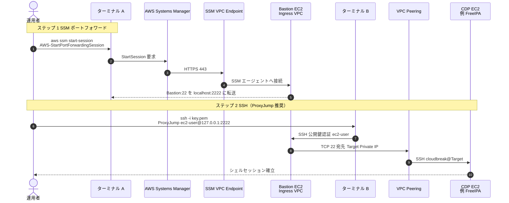
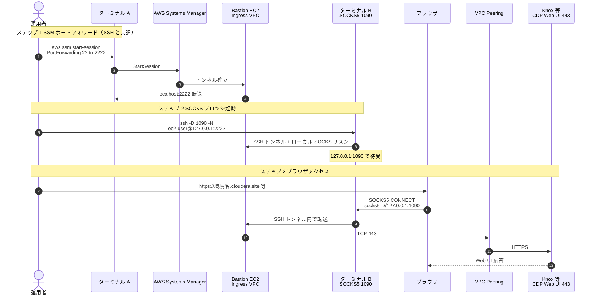
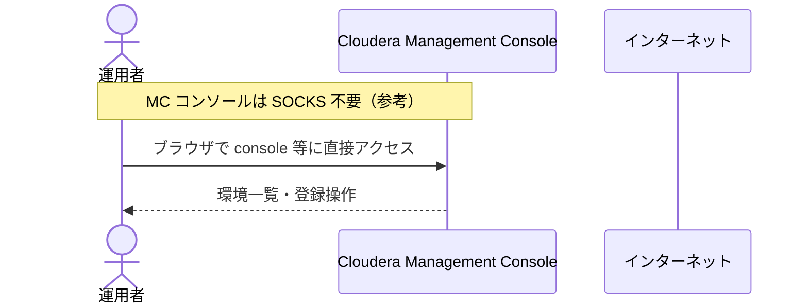

# フルプライベート CDP 環境 運用者アクセス手順書

本書は、構築済みのフルプライベート構成において、運用者 PC から **CDP Workload VPC 内の EC2 へ SSH 接続**する方法と、**SOCKS プロキシ経由でブラウザから CDP UI にアクセス**する方法をまとめたものです。

関連ドキュメント:

- [ネットワーク設計書](network-design-full-private.md)
- [構築手順書](deployment-procedure-full-private.md)

---

## 1. 接続の考え方

CDP Workload VPC 内のインスタンスには **パブリック IP がありません**。運用者は次の経路でアクセスします。

```text
運用者 PC
  → AWS Systems Manager (Session Manager) … Ingress VPC の Bastion へ
  → VPC Peering … CDP Workload VPC 内の EC2 へ（SSH / HTTPS）
```

| 用途 | 経路 |
| --- | --- |
| SSH（FreeIPA / ノード等） | SSM → Bastion → Peering → 対象 EC2 `:22` |
| ブラウザ（`*.cloudera.site` 等） | SSM → Bastion → SOCKS (`localhost:1090`) → Peering → Knox / UI `:443` |

Ingress VPC（`10.99.0.0/24`）の Bastion は **SSM のみ**で入り、SSH 鍵は `aws-init` で作成したものを CDP ノードと共有します。

---

## 2. 前提条件

### 2.1 ローカル環境

| 項目 | 内容 |
| --- | --- |
| AWS CLI v2 | インストール済み |
| Session Manager プラグイン | [AWS 公式手順](https://docs.aws.amazon.com/systems-manager/latest/userguide/session-manager-working-with-install-plugin.html) でインストール |
| OpenSSH クライアント | `ssh` コマンドが利用可能 |
| 秘密鍵 | `aws-init` 適用時に生成された `<env_prefix>-ssh-key.pem`（例: `ts0528p-ssh-key.pem`） |
| 権限 | Bastion への `ssm:StartSession`、CDP VPC の EC2 参照権限 |

### 2.2 AWS 側の構築済み要件

次が完了していること（構築手順書参照）。

| 項目 | 確認 |
| --- | --- |
| `aws-ingress` 適用済み | Bastion が `running` |
| Ingress ↔ CDP VPC Peering | `active` |
| `aws-init` の `ingress_extra_cidrs_and_ports` | Ingress CIDR（`10.99.0.0/24`）から **TCP 22 / 443** が CDP SG に許可されている |
| SSH 鍵ペア | `aws-init` の `<env_prefix>-keypair` が Bastion / CDP ノードに登録されている |
| `aws-ingress` の `bastion_key_name` | **`aws-init` のキーペア名と同一**（未指定時は `ntt-poc-keypair` となり手元の `.pem` と不一致） |

`ingress_extra_cidrs_and_ports` が未設定の場合、Bastion から CDP VPC への SSH は **セキュリティグループで拒否**されます。

```hcl
# aws-init の tfvars 例
ingress_extra_cidrs_and_ports = {
  cidrs = ["10.99.0.0/24"]
  ports = [22, 443]
}
```

### 2.3 環境変数の設定（推奨）

以降のコマンドで使う値を環境変数にまとめます。実環境の値に置き換えてください。

```bash
export AWS_PROFILE=<YOUR_AWS_PROFILE>
export AWS_REGION=ap-northeast-1
export ENV_PREFIX=ts0528p

# aws-init で生成した秘密鍵（パスは環境に合わせる）
export SSH_KEY="${HOME}/path/to/${ENV_PREFIX}-ssh-key.pem"
chmod 600 "${SSH_KEY}"
```

Bastion インスタンス ID の取得:

```bash
cd aws-ingress
export BASTION_ID=$(terraform output -raw bastion_instance_id)
export BASTION_IP=$(terraform output -raw bastion_private_ip)
echo "BASTION_ID=${BASTION_ID}  BASTION_IP=${BASTION_IP}"
```

CDP VPC ID の取得（対象 EC2 検索用）:

```bash
cd ../aws-init
export CDP_VPC_ID=$(terraform output -raw aws_vpc_id)
export CDP_VPC_CIDR=$(terraform output -raw aws_vpc_cidr)
echo "CDP_VPC_ID=${CDP_VPC_ID}  CDP_VPC_CIDR=${CDP_VPC_CIDR}"
```

---

## 3. CDP VPC 内 EC2 への SSH 接続

### 3.1 接続の流れ（概要）

1. **ターミナル A**: SSM で Bastion に接続し、Bastion の SSH ポートをローカルに転送する
2. **ターミナル B**: ローカル転送先（`localhost:2222`）経由で、Peering 越しに CDP VPC 内 EC2 へ SSH する

### 3.1.1 接続シーケンス図（ターミナル / SSH）

Bastion にはインバウンド SSH を開けず、**SSM 経由でポート 22 をローカルに転送**してから CDP VPC 内へ SSH します。



| 番号 | 説明 |
| --- | --- |
| 1〜5 | ターミナル A を開いたまま維持（転送トンネル） |
| 6〜10 | ターミナル B で SSH。鍵は `bastion_key_name` と一致する `.pem` |
| 7〜9 | Ingress SG は CDP へのアウトバウンド 22 のみ。CDP SG は `ingress_extra_cidrs_and_ports` で 10.99.0.0/24 から 22 を許可 |

### 3.2 ステップ 1: SSM ポートフォワード（ターミナル A）

Bastion の `22` をローカルの `2222` に転送します。**このターミナルは接続中は開いたまま**にしてください。

```bash
aws ssm start-session \
  --region "${AWS_REGION}" \
  --profile "${AWS_PROFILE}" \
  --target "${BASTION_ID}" \
  --document-name AWS-StartPortForwardingSession \
  --parameters '{"portNumber":["22"],"localPortNumber":["2222"]}'
```

成功すると、セッションが維持されている間 `localhost:2222` が Bastion の SSH ポートに届きます。

別案（対話シェルが不要な場合）:

```bash
aws ssm start-session \
  --region "${AWS_REGION}" \
  --profile "${AWS_PROFILE}" \
  --target "${BASTION_ID}"
```

対話シェルから Bastion 上で `ssh` する運用も可能です（3.4 参照）。

### 3.3 ステップ 2: 接続先 EC2 の特定

CDP VPC 内のインスタンス一覧（Private IP / Name）:

```bash
aws ec2 describe-instances \
  --region "${AWS_REGION}" \
  --profile "${AWS_PROFILE}" \
  --filters "Name=vpc-id,Values=${CDP_VPC_ID}" \
            "Name=instance-state-name,Values=running" \
  --query 'Reservations[*].Instances[*].{
    Name:Tags[?Key==`Name`].Value|[0],
    InstanceId:InstanceId,
    PrivateIp:PrivateIpAddress,
    AZ:Placement.AvailabilityZone
  }' \
  --output table
```

よく使う接続先の例:

| 種別 | Name タグの例 | SSH ユーザー |
| --- | --- | --- |
| FreeIPA | `*-freeipa*` または環境名付き | `cloudbreak` |
| その他 CDP ノード | 環境・クラスタ名付き | `cloudbreak` |
| Bastion 自身 | `<env_prefix>-bastion` | `ec2-user` |

接続先 IP を変数に設定（例: FreeIPA）:

```bash
export TARGET_IP=10.10.xx.xx   # 上記一覧の PrivateIp
export TARGET_USER=cloudbreak
```

### 3.4 ステップ 3: SSH 接続（ターミナル B）

**ターミナル A でポートフォワードが有効な状態**で実行します。

#### 方法 A: 二段 SSH（Bastion 経由で CDP ノードへ）

```bash
ssh -i "${SSH_KEY}" \
  -p 2222 \
  -o StrictHostKeyChecking=accept-new \
  -o ProxyCommand="ssh -i ${SSH_KEY} -p 2222 -W %h:%p ec2-user@127.0.0.1" \
  "${TARGET_USER}@${TARGET_IP}"
```

シンプルな二段接続（手動）:

```bash
# 1) まず Bastion に入る（ポートフォワード経由）
ssh -i "${SSH_KEY}" -p 2222 ec2-user@127.0.0.1

# 2) Bastion 上から CDP ノードへ
ssh -i ~/.ssh/id_rsa cloudbreak@${TARGET_IP}
# ※ Bastion に鍵を配置していない場合は、ローカル鍵を agent 転送する方法を使う（方法 B）
```

#### 方法 B: `ProxyJump`（推奨・1 コマンド）

OpenSSH 7.3 以降:

```bash
ssh -i "${SSH_KEY}" \
  -o "ProxyJump=ec2-user@127.0.0.1:2222" \
  -o StrictHostKeyChecking=accept-new \
  "${TARGET_USER}@${TARGET_IP}"
```

#### 方法 C: SSM シェル上から Bastion 内で SSH

ターミナル A で通常の `start-session`（ポートフォワードなし）を使う場合:

```bash
# ローカルで鍵を Bastion に一時コピーする代わりに、Session Manager でシェル取得後:
ssh cloudbreak@${TARGET_IP}
```

Bastion に秘密鍵が無い場合は、ローカルから `ProxyJump`（方法 B）を使う方が簡単です。

### 3.5 Bastion 自身への SSH（デバッグ用）

```bash
ssh -i "${SSH_KEY}" -p 2222 ec2-user@127.0.0.1
```

### 3.6 接続確認（Bastion 上）

SSM 対話シェルで Bastion に入った状態から:

```bash
# Peering 経由で CDP VPC へ到達できるか
nc -zv "${TARGET_IP}" 22

# 名前解決が必要な場合（private DNS）
getent hosts "${TARGET_IP}"
```

---

## 4. SOCKS プロキシ経由のブラウザアクセス

CDP の Web UI（Knox、Cloudera Manager、Data Services 等）は **`*.cloudera.site`** などのホスト名で提供されます。プライベート環境では、Bastion 経由の **SOCKS プロキシ**でブラウザから HTTPS アクセスします。

### 4.1 接続の流れ（概要）

1. **ターミナル A**: SSM ポートフォワード（`bastion:22` → `localhost:2222`）— [3.2](#32-ステップ-1-ssm-ポートフォワードターミナル-a) と同じ
2. **ターミナル B**: ローカルで SOCKS プロキシを起動（`localhost:1090`）
3. **ブラウザ**: SOCKS `localhost:1090` を使い、`*.cloudera.site` 等へアクセス

### 4.1.1 接続シーケンス図（ブラウザ / SOCKS）

Management Console（SaaS）はインターネットから直接開きます。**環境内 Web UI**（`*.cloudera.site`）のみ SOCKS 経由です。



| 番号 | 説明 |
| --- | --- |
| 1〜5 | [3.2](#32-ステップ-1-ssm-ポートフォワードターミナル-a) と同一（ターミナル A を維持） |
| 6〜8 | ターミナル B は `-N` でトンネルのみ。シェルは開かない |
| 9〜13 | ブラウザは拡張機能で `*.cloudera.site` のみ SOCKS へ（推奨） |
| 10〜12 | CDP SG は `ingress_extra_cidrs_and_ports` で 10.99.0.0/24 から **443** を許可 |



### 4.2 ステップ 1: SSM ポートフォワード（ターミナル A）

[3.2 ステップ 1](#32-ステップ-1-ssm-ポートフォワードターミナル-a) と同じコマンドを実行し、**開いたまま**にします。

### 4.3 ステップ 2: SOCKS プロキシの起動（ターミナル B）

```bash
ssh -i "${SSH_KEY}" \
  -p 2222 \
  -D 1090 \
  -N \
  -o StrictHostKeyChecking=accept-new \
  ec2-user@127.0.0.1
```

| オプション | 意味 |
| --- | --- |
| `-D 1090` | ローカル `127.0.0.1:1090` で SOCKS5 リスン |
| `-N` | リモートでコマンドを実行しない（トンネルのみ） |
| `-p 2222` | SSM ポートフォワード先 |

このターミナルも **接続中は開いたまま**にしてください。

動作確認（別ターミナル）:

```bash
curl -sS -o /dev/null -w "%{http_code}\n" \
  --proxy socks5h://127.0.0.1:1090 \
  https://<your-environment>.cloudera.site/
```

環境の FQDN は Management Console の Environment 詳細、または `cdp environments describe-environment` で確認します。

### 4.4 ステップ 3: ブラウザの設定

#### 推奨: プロキシ切り替え拡張機能（例: Proxy SwitchyOmega / ZeroOmega）

全トラフィックを SOCKS に流さず、**CDP 関連ドメインのみ**プロキシする設定を推奨します。

| 項目 | 値 |
| --- | --- |
| プロトコル | SOCKS5 |
| サーバ | `127.0.0.1` |
| ポート | `1090` |
| 適用パターン（例） | `*.cloudera.site` |

追加で必要になる場合があるパターン（環境依存）:

- `*.cloudera.com`（コンソールリダイレクト等）
- 環境固有の Knox / CM URL（MC に表示される FQDN）

#### macOS システムプロキシ（非推奨・全体に影響）

システム設定 → ネットワーク → プロキシ → SOCKS を `127.0.0.1:1090` にすると **全アプリ**がプロキシ経由になります。CDP 用途のみに絞る場合は拡張機能の方が安全です。

### 4.5 Management Console との関係

- **Cloudera Management Console**（SaaS コンソール）自体は、通常どおりインターネットからブラウザで開きます（SOCKS 不要）。
- **環境内の Web UI**（Data Hub、Knox、CM UI 等の `*.cloudera.site`）は、本書の SOCKS 経由でアクセスします。

### 4.6 接続確認チェックリスト

| # | 確認 | 期待 |
| --- | --- | --- |
| 1 | SSM ポートフォワード（ターミナル A） | セッション維持中 |
| 2 | `ssh -D 1090 ...`（ターミナル B） | エラーなく待機 |
| 3 | `curl --proxy socks5h://127.0.0.1:1090 https://<env>.cloudera.site/` | HTTP 200 / 302 等 |
| 4 | ブラウザで Knox / CM URL | ログイン画面または UI 表示 |

---

## 5. 運用時の注意

### 5.1 セキュリティ

- 秘密鍵（`.pem`）は **600 権限**で保管し、共有・コミットしない
- Bastion には **インバウンド SSH を開けない**（SSM のみ）
- SOCKS は使用後に **ターミナル B を終了**し、ブラウザ拡張のプロキシを OFF に戻す
- 運用者 PC の AWS 認証情報は最小権限のプロファイルを使用する

### 5.2 同時利用

| 用途 | ターミナル構成 |
| --- | --- |
| SSH のみ | A: ポートフォワード、B: `ssh` |
| ブラウザのみ | A: ポートフォワード、B: `ssh -D 1090 -N` |
| SSH + ブラウザ | A: ポートフォワード、B: SOCKS、C: 別途 `ssh`（または SOCKS 維持しつつ SSH は ProxyJump） |

1 つのポートフォワードセッション（`2222`）を **SSH と SOCKS で共有**できます。

### 5.3 よくあるトラブル

| 症状 | 確認・対処 |
| --- | --- |
| `TargetNotConnected`（SSM） | Bastion が `running` か、SSM エージェント Online か、VPC Endpoint（`ssm` / `ssmmessages` / `ec2messages`）があるか |
| `Connection refused`（`localhost:2222`） | ターミナル A のポートフォワードが起動しているか |
| SSH で `Permission denied` | ユーザー名（`cloudbreak` / `ec2-user`）、鍵パス、`ingress_extra_cidrs_and_ports` の 22 番許可 |
| SSH でタイムアウト | Peering が `active` か、CDP 側ルートに Ingress CIDR 向けルートがあるか、対象 SG |
| SOCKS で UI が開かない | ターミナル B が生きているか、ブラウザのプロキシ設定、`*.cloudera.site` パターン、正しい環境 FQDN |
| `curl` は OK だがブラウザ NG | 拡張機能のプロファイル適用漏れ、HTTPS DNS がローカル解決されている（`socks5h` で名前解決をプロキシ側に） |

Peering 確認:

```bash
cd aws-ingress
aws ec2 describe-vpc-peering-connections \
  --vpc-peering-connection-ids "$(terraform output -raw peering_connection_id)" \
  --query 'VpcPeeringConnections[0].Status.Code' \
  --output text
```

期待値: `active`

### 5.4 参考コマンド一覧

```bash
# Bastion 状態
aws ssm describe-instance-information \
  --filters "Key=InstanceIds,Values=${BASTION_ID}" \
  --query 'InstanceInformationList[0].PingStatus' \
  --output text

# Environment のドメイン名（CDP CLI）
cdp environments describe-environment \
  --environment-name "${ENV_PREFIX}-cdp-env" \
  | jq -r '.environment.domain'
```

---

## 6. クイックリファレンス

### SSH（FreeIPA 等）

```bash
# ターミナル A
aws ssm start-session --target "${BASTION_ID}" \
  --document-name AWS-StartPortForwardingSession \
  --parameters '{"portNumber":["22"],"localPortNumber":["2222"]}'

# ターミナル B
ssh -i "${SSH_KEY}" -o "ProxyJump=ec2-user@127.0.0.1:2222" cloudbreak@<TARGET_PRIVATE_IP>
```

### ブラウザ（SOCKS）

```bash
# ターミナル A（上記と同じポートフォワード）

# ターミナル B
ssh -i "${SSH_KEY}" -p 2222 -D 1090 -N ec2-user@127.0.0.1

# ブラウザ: SOCKS5 127.0.0.1:1090、*.cloudera.site
```

---

## 7. 改訂履歴

| 日付 | 内容 |
| --- | --- |
| 2026-05-30 | 初版（SSH / SOCKS 運用手順） |
| 2026-05-30 | SSH / SOCKS の Mermaid 接続シーケンス図を追加 |
